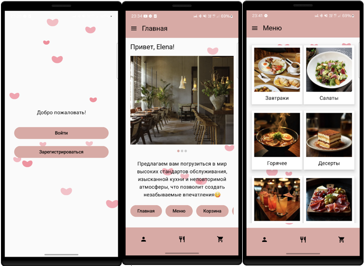

# Citnamor
Android приложение для ресторана с системой заказов и лояльности.

## 📱 Описание
Citnamor – мобильное приложение для Android, разработанное с использованием Jetpack Compose и Material 3, предназначенное для заказа блюд в ресторане с системой баллов лояльности.

## 🌟 Основной функционал

### Аутентификация и профиль
- **Регистрация и вход** с безопасным хранением данных в локальной БД
- **Профиль пользователя** с возможностью загрузки фото и редактирования имени
- **Система баллов лояльности** - автоматическое начисление 10% от суммы заказа

### Меню и заказы
- **Каталог блюд** по категориям: завтраки, горячие блюда, салаты, десерты, напитки, специальные предложения
- **Корзина заказов** с возможностью изменения количества и удаления товаров
- **Оформление заказов** с уведомлениями о статусе и начисленных баллах

### Пользовательский опыт
- **Интуитивный интерфейс** с Material Design 3 и Jetpack Compose
- **Удобная навигация** через боковое меню и нижнюю панель
- **Система уведомлений** о заказах и начисленных баллах
- **Адаптивный дизайн** с фирменным нежно-розовым цветом

## 🛠 Технологии
- **Jetpack Compose** - современный UI toolkit
- **Material Design 3** - дизайн-система
- **Room Database** - локальная база данных
- **Navigation Component** - навигация между экранами
- **ViewModel (MVVM)** - управление состоянием UI
- **Kotlin Coroutines** - асинхронная работа
- **Coil** - загрузка изображений
- **Системные уведомления** - push-уведомления о заказах

## 🏗 Архитектура
- **MVVM** с разделением на Presentation и Data слои
- **Room** для локального хранения пользователей и заказов
- **Offline-first** подход - работа без интернета
- **Масштабируемая структура** для будущего развития

## 📋 База данных
**Таблица users:**
- `id` (String) - первичный ключ
- `name` (String) - имя пользователя  
- `email` (String) - email пользователя
- `password` (String) - пароль
- `profileImageUri` (String?) - URI изображения профиля
- `points` (Int) - баллы пользователя

## 🚀 Перспективы развития
- Онлайн-бронирование столиков
- Интеграция с платежными системами
- Доставка и отслеживание курьера
- Социальные функции (отзывы, рейтинги)
- Аналитика для владельцев
- iOS-версия приложения
- Интеграция с внешними сервисами

📤 Автор

[Irina A.]

📧 Email: [wsrfyh75@gmail.com]
📱 Telegram: [@Bys1nk4]

📂 Дополнительные материалы
- 📄 Отчёт по проекту: [ОтчётCR.docx](ОтчётCR.docx)
- 💻 Презентация по проекту:[ПрезентацияCR.pptx](ПрезентацияCR.pptx)
- 📜 Выступление по проекту: [ВыступлениеCR.docx](ВыступлениеCR.docx)

## 📄 Лицензия

MIT License Copyright (c) 2025 Irina A.